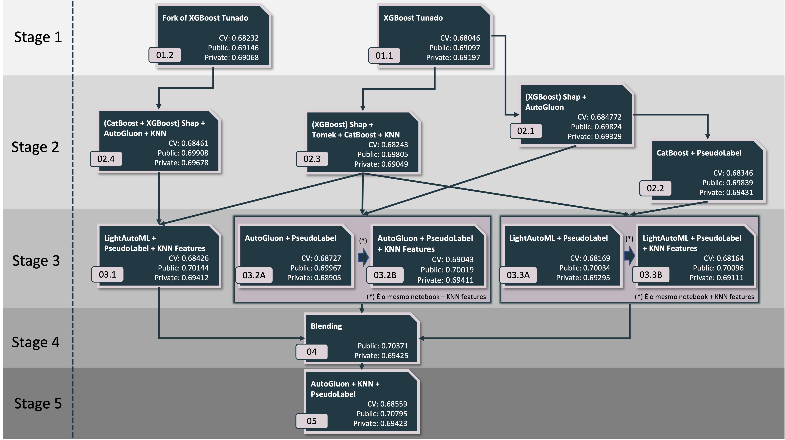

# Porto Seguro Data Challenge

<strong>Estime a propensão de aquisição a novos produtos</strong>

<center>

</center>

## Sobre

Da descrição da [página oficial](https://www.kaggle.com/c/porto-seguro-data-challenge):

> Nessa competição você será desafiado a construir um modelo que prediz a probabilidade de aquisição de um produto.

O objetivo final é obter o maior F1 Score possível prevendo o rótulo da target em um problema de classificação binária.  

## Quick Start

Todos os notebooks deste repositório foram desenvolvidos diretamente na plataforma do Kaggle. Os pacotes que não estavam disponíveis nativamente na plataforma foram instalados na primeira celula de cada notebook.

Para ajudar na reprodutibilidade, todos os inputs e outputs foram fixados nas pastas dos respectivos notebooks com a seguinte organização:

```
├── notebook_xpto\
    ├── code\   <- Notebook desenvolvido no Kaggle
    ├── input\  <- Todos inputs necessários para rodar o respectivo notebook
    └── output\ <- Arquivos com previsões geradas pelo modelo 
```

Na pasta `output\` estarão 3 arquivos: 

  1. Arquivo de submissão com classe 0 ou 1;
  2. Previsão da probabilidade nos dados de teste;
  3. Previsões da probabilidade out-of-fold nos dados de treino.


<div class="alert alert-warning"> 
<big><strong>⚠️ Atenção! <br></strong> </big>
    
<div style="color: rgb(0, 0, 0);">Todos os notebooks estão com enumerados!</div>
</div>

Os prefixos númericos dos notebooks de cada notebook corresponde ao seguinte fluxo: 

<center>

</center>

</br>

Todos os outputs de modelos que foram utilizados como inputs nas etapas seguintes foram baixados do kaggle e já estão localizados na pasta `input/` para facilitar a reprodução dos notebooks pois mesmo fixando as *seeds*, a reprodução de alguns notebooks (que usam AutoML) podem variar devido à natureza estocástica do algoritmo.


